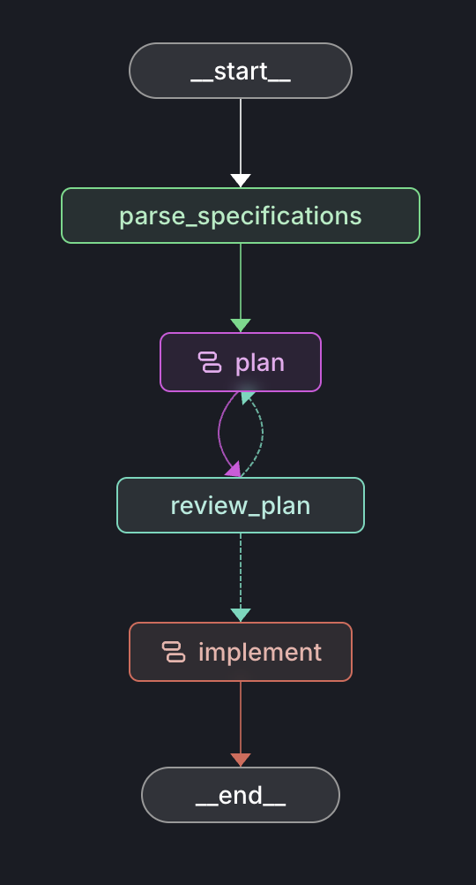
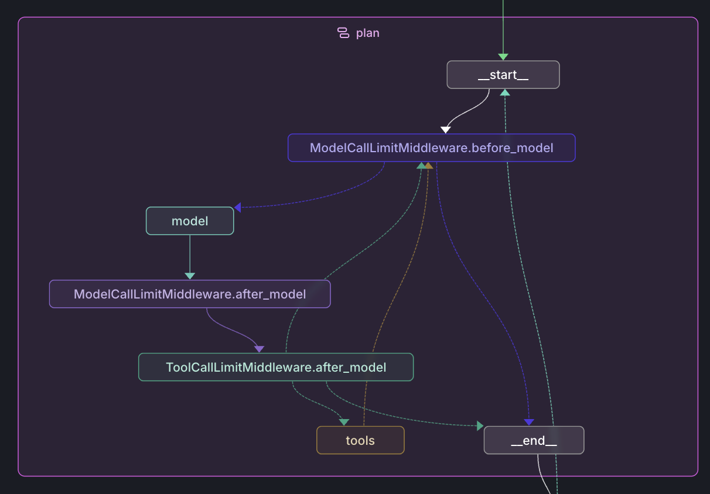
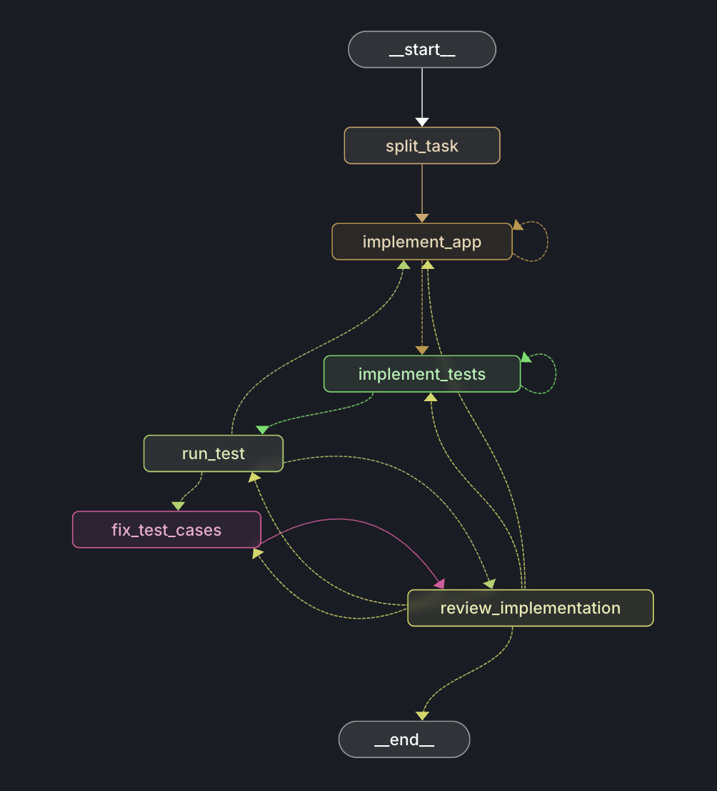

# Agentic Code Generation Workflow

## How to run

### Setup
```bash
python -m venv .venv
source .venv/bin/activate

uv sync
# or
pip install -r requirements.txt
```
### Run locally
```bash
python run_local.py --spec-file spec.txt
```

### Alternative: Run in LangSmith
LangSmith provides an interactive UI to visualize the agent, to monitor its activity at real time, and to understand token usage at every node. However, it requires a `LANGSMITH_API_KEY`, you can sign up [here](https://docs.langchain.com/langsmith/create-account-api-key#create-an-account-and-api-key).
```bash
langgraph dev
```

### Rollback changes in boilerplate
This bash script with the option `--clean-untracked` will roll back all changes and remove node_modules folder
```bash
./scripts/rollback_frontend.sh --clean-untracked
```

## Stack
| Stack             | Choice                                                             | Remarks                                                                                                                                                                                                                                                                                                                                                                                    |
|:------------------|:-------------------------------------------------------------------|:-------------------------------------------------------------------------------------------------------------------------------------------------------------------------------------------------------------------------------------------------------------------------------------------------------------------------------------------------------------------------------------------|
| LLM               | gpt-4o-mini & gpt-5.4-mini                                         | I didn't choose the most powerful coding-specialized models such as gpt-5.3-codex, claude-opus-4-6 and claude-sonnet-4-6, because I want to showcase that with the right workflow and agentic patterns, coupled with good context management and prompt engineering, even small models are capable of agentic coding. GPT-5.4-mini offers a perfect tradeoff between cost and performance. |
| Agentic framework | LangChain & LangGraph                                              | LangGraph offers a sweet middle-ground between control and flexibility, while LangChain offers the ability to quickly switch between LLM models and prebuilt agent patterns. I also find LangSmith very useful in debugging and optimization due to its tracing capability.                                                                                                                |
| Tooling           | skills, limited file system operations and limited shell execution | Limited file system operations and limited shell execution within the boilerplate for security reasons. Skills are provided to LLM to maintain best practices of React 19, Typescript, MUI, etc.                                                                                                                                                                                           |

## Design
For this take home challenge, I took inspiration of [OpenSpec](https://github.com/Fission-AI/OpenSpec), a very popular spec-driven framework that I really like to use when coding with Cursor. I took the concepts of **design.md**, **approach.md** and **task.md** from this framework, which are useful in minimizing hallucinations of LLMs and ensure that LLMs stay coherent the whole time.

## Architecture
**Multi-stage self-validation**, **LLM-as-judge**, **skills pattern** and **tool use** throughout the whole workflow allows this agent to produce high-quality code without sacrificing governance and flexibility.

|                           | Graph                                               | Description             |
|:--------------------------|:----------------------------------------------------|:------------------------|
| Main Graph                |     | The main graph uses a **ReAct pattern** in the planning stage to make sure the agent gets enough context from the frontend repository with available tools. It also uses an **evaluator-optimizer pattern** to validate the plan. |
| Subgraph (plan)           |          | Inside the planning stage, the LLM model is given maximum flexibility to explore the repository while being restricted to read only access, limited tool call and limited iteration. |
| Subgraph (Implementation) |  | Inside the implementation stage, both implement_app and implement_test use the **ReAct pattern** and has its **own evaluator** to make sure all requirements are met before moving on to the next stage. On test errors, run_test node routes to implement_app or implement_test based on the error type. review_implementation ensures all tasks are done and the test coverage is enough before completing the workflow. |


## Workflow
1. Parse product specification, convert into detailed specification.
2. Get context from current repo. Decide the approach that suits the current repo. Define the tasks required based on the approach.
3. Review the product specification, check design, approach and tasks to make sure that they are coherent. If not, re-run from step 2.
4. Implement tasks (except test cases), ensure all tasks are done and type check passed before proceeding.
5. Implement test cases, ensure type check passed before proceeding. 
6. Run test cases. If there is any error, determine whether there is a bug in the code or test cases, then route back to step 5 or step 6. 
7. Determine whether all tasks are done, and whether the test coverage is enough.

## Optimization Techniques Applied

The following optimizations were implemented to improve token efficiency, latency, and reliability while preserving agent behavior.

1. **Collapsed post-coding analysis into one structured call**
   - Before: two separate LLM calls after each implementation phase (`implementation_summary` and `implementation_validation`).
   - After: one combined structured output (`ImplementationPostRunResponse`) that returns summary, touched files, validation summary, and final typecheck status.
   - Why it helps: avoids parsing the same implementation transcript twice.

2. **Added specification-grounding guardrails to prevent framework drift**
   - Updated the specification-conversion prompt to avoid mandating unrequested frameworks (for example, forcing Jest in a Vitest repo).
   - Why it helps: reduces upstream plan/coding drift and rework caused by repo-stack mismatch.

3. **Introduced an implementation subgraph state boundary**
   - Added `ImplementationSubgraphState` and a wrapper node (`run_implementation_subgraph`) to pass only implementation-relevant fields into the implementation subgraph and map back only needed outputs.
   - Why it helps: reduces state coupling between planning and implementation loops, and makes the data contract explicit.

4. **Reduced prompt payload size in implementation phases**
   - Added bounded truncation for high-volume inputs passed to coding nodes:
     - detailed specs
     - repo context
     - design
     - approach
     - prior test output
   - Why it helps: lowers repeated context size per coding turn, which directly reduces token usage in long implementation loops.

5. **Added anti-redundant tool-usage guidance**
   - Updated implementation system prompt to discourage re-reading the same file unless needed.
   - Why it helps: reduces unnecessary tool churn and repeated context accumulation.

6. **Established trace-driven optimization workflow**
   - Used LangSmith trace exports (`get_trace.py`) to identify token/latency hotspots and validate each optimization with before/after comparisons.
   - Why it helps: ensures optimizations are evidence-based instead of guess-based.

### Practical Outcome

- The latest full run is approximately **267.6K tokens**, with optimization focused on the highest-cost area (`implement_*`) while keeping behavior stable.

## Tradeoff
1. We can definitely use a more powerful model for this project to speed up each run, such as gpt-5.3-codex, claude-opus-4-6 and claude-sonnet-4-6. I used gpt-5.4-mini and gpt-4o-mini because of cost optimization.
2. The workflow design may seem a little bit too much for this project. However, I try to mimic real-life situation with this workflow, like addressing vague product specifications, dealing with complex codebases, and upholding high quality standard.
3. I introduced the best practices of React 19, Typescript, Vite, Apollo Client, GraphQL and vitest to LLMs through skills, therefore this agent may use more time and tokens compared to others. It may not make a huge difference in code quality in this project, but introducing these best practices to LLMs is key in real-life situations.
4. For demo purpose, I did not introduce human-in-the-loop in this agent because I don't want to confuse the reviewers with a really complex workflow. But in reality, human-in-the-loop is definitely required, especially before the actual implementation. 

## Changes made to the boilerplate config
In order to better parse the vitest results into LLM, I changed the test command from `vitest run` to `vitest run --reporter=json --outputFile=.tmp/vitest.json`. It significantly reduces the context while increasing readability because it has a predictable format.